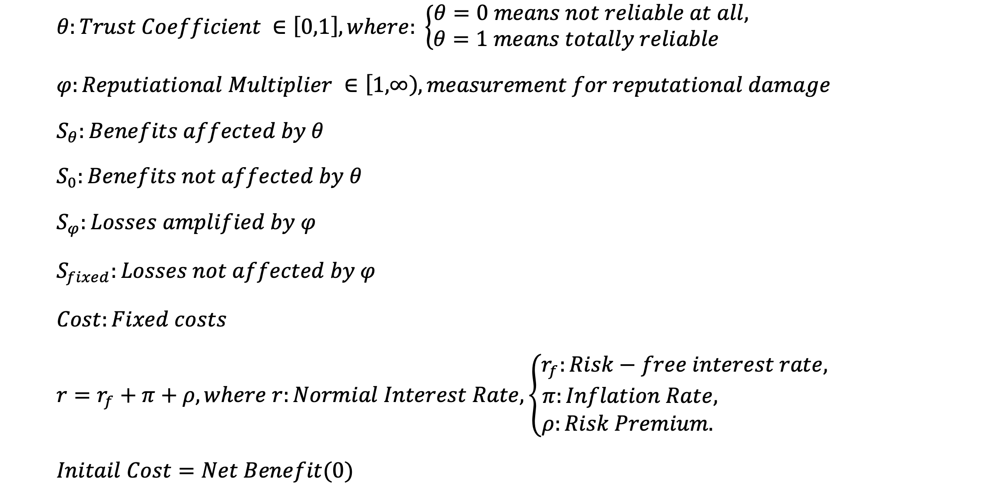
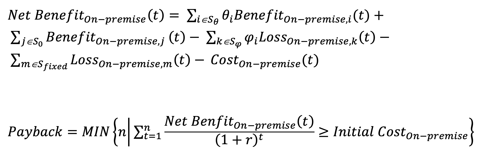
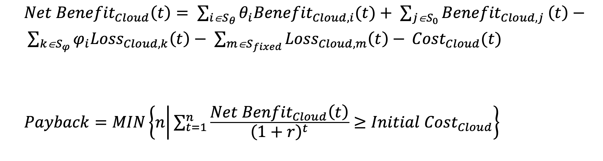
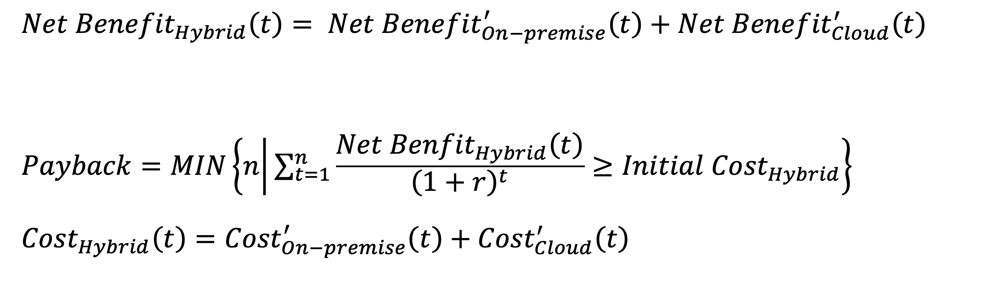
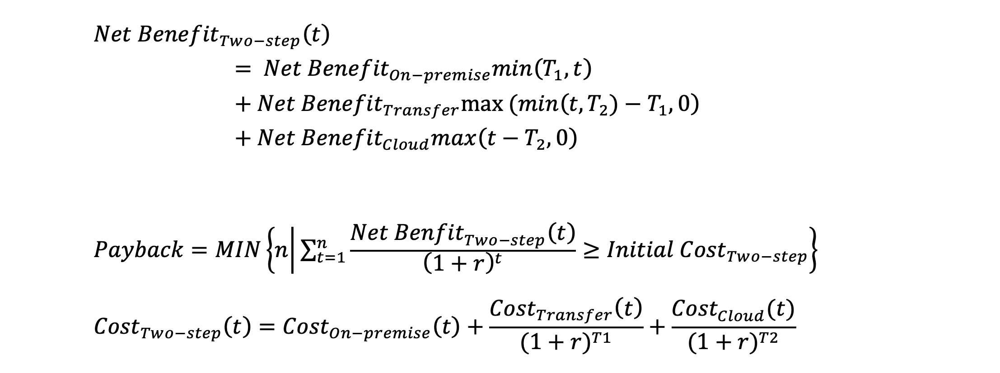

### Basic Identification

***This idea of precise modelling was generated at the initial stage, thus the idea is some kind of rough***

There are 4 basic scenario to apply blockchain on supply chain:
1. The whole blockchain system is deployed in the on-premises environment
2. The whole blockchain system is deployed in cloud environment
3. The blockchain system is deployed in the hybrid: cloud + on-premises environment
4. 2 step: first on-premises, then cloud (a hidden transfer step)

### Variables & Parameters


### Scenario 1: On-premises


#### For S<sub>θ</sub>:

**Recall scope reduction and faster localization**: Customers can be notified precisely by batch, serial number, time window, or store.

**Higher compliance and audit pass rates**: FSMA/cold chain records, origin and inspection certificates can be verified online.

**Reduction of quality losses**: Source inspections, third-party laboratory tests, and exception handling records can be validated.

**Prevention of adulteration or substitution**: Origin, species/grade, and certificates such as MSC/organic are matched with blockchain fingerprints.

**Cold-chain compliance reduces spoilage**: Store and truck temperature curves and loading/unloading timestamps can be audited and checked by customers.

**Shelf-life and product age transparency reduces forced markdowns**: Batch, production/slaughter/catch date, and shelf placement date are connected.

**Insurance optimization**: Traceability and compliance rates, once validated on-chain, are recognized by insurers and reduce premiums or deductibles.

#### For S<sub>0</sub>:

**Reduced workload in customer service and stores**: Customers scan QR codes to access origin, test results, and allergen data.

**Automated document reconciliation**: Public-facing pages and internal ledgers are generated automatically, reducing manual work.

**Improved OTIF and exception closure efficiency**: Transparent KPIs drive supplier improvement.

**Automated audits and reporting**: Direct export for regulators and partners.

**Inventory rotation optimization**: Product age visibility supports first-in-first-out.

**New customer acquisition and market share growth**: “Scannable traceability” is promoted as a selling point.

**B2B and channel access**: Meeting requirements for “mandatory consumer-facing traceability” in some markets.

**Lower safety stock and improved payment terms/price negotiation**: Higher process certainty drives working capital efficiency.

**Reduction of tail risk expected loss (severity × frequency)**: A systemic traceability framework reduces catastrophic event exposure.

**Subsidies, tax incentives, and ESG-based financing benefits**: Institutional advantages from compliance and transparency.

#### For S<sub>φ</sub>: 

**Amplification of reputational incidents**: Minor label or batch inconsistencies or small temperature deviations are magnified on social media.

**Reverse effect on conversion and premium**: Trust or premium margins eroded when negative events are magnified.

**Regulatory echo effect**: Publicly visible data triggers additional inspections or disclosures, causing indirect business loss.

#### For S<sub>fixed</sub>:

**Direct technical and operational losses**: Device failure, downtime of QR code pages or SMS notifications.

**Regulatory and contractual penalties**: Fixed fines or damages not dependent on public transparency.

**Routine unavoidable losses**: Label scrap, training downtime, regular shrinkage.

#### For Cost:

**CapEx**: Public information pages / QR-code H5 interface for customers, in-store QR scanning terminals, public traceability API and data-masking engine, packaging and label redesign with printing assets, media evidence collection and digital signing capability, ```on-premise blockchain node servers and data center facilities (servers, storage, network equipment, power and cooling), security infrastructure (HSM, on-premise key management system)```.

**OpEx**: QR code / short-link and page hosting, multilingual content and accessibility compliance, in-store training sessions and printed materials, media monitoring and crisis-response drills, external data archiving and legal review, third-party annual audit (limited to public disclosure scope), ```hardware operation and maintenance (equipment servicing, network and power consumption), depreciation of servers and storage hardware```.

**Governance**: Supplier whitelist/blacklist admission for “publicly disclosed data,” policies for data fields and display thresholds, red-line/yellow-line rules and automatic takedown or masking logic.


### Scenario 2: Cloud


#### For Cost:

**CapEx**: Public information pages / QR-code H5 for customers, in-store QR scanning terminals, public traceability API and data-masking engine, packaging and label redesign with printing assets, media evidence collection and digital signing capability, ```cloud tenant initialization and account/permission baseline configuration```.

**OpEx**: QR code / short-link and page hosting, multilingual content and accessibility compliance, in-store training sessions and printed materials, media monitoring and crisis-response drills, external data archiving and legal review, third-party annual audit (limited to public disclosure scope), ```cloud platform subscription and resource consumption (ledger transaction volume / storage / bandwidth / logging services)```.

**Governance**: Supplier whitelist/blacklist admission for “publicly disclosed data,” policies for data fields and display thresholds, red-line/yellow-line rules and automatic takedown or masking logic.


### Scenario 3: Hybrid


#### For Cost:

**CapEx**: Public information pages / QR-code H5 for customers, in-store QR scanning terminals, public traceability API and data-masking engine, packaging and label redesign with printing assets, media evidence collection and digital signing capability, ```cloud tenant initialization and account/permission baseline configuration, on-premise blockchain node servers and data center facilities (servers, storage, network equipment, power and cooling), security infrastructure (HSM, on-premise key management system)```.

**OpEx**: QR code / short-link and page hosting, multilingual content and accessibility compliance, in-store training sessions and printed materials, media monitoring and crisis-response drills, external data archiving and legal review, third-party annual audit (limited to public disclosure scope), ```cloud platform subscription and resource consumption (ledger transaction volume / storage / bandwidth / logging services), hardware operation and maintenance (equipment servicing, network and power consumption), depreciation of servers and storage hardware```.
    
**Governance**: Supplier whitelist/blacklist admission for “publicly disclosed data,” policies for data fields and display thresholds, red-line/yellow-line rules and automatic takedown or masking logic.

### Scenario 4: 2steps


#### For Cost:

**CapEx**: Public information pages / QR-code H5 for customers, in-store QR scanning terminals, public traceability API and data-masking engine, packaging and label redesign with printing assets, media evidence collection and digital signing capability, ```cloud tenant initialization and account/permission baseline configuration, on-premise blockchain node servers and data center facilities (servers, storage, network equipment, power and cooling), security infrastructure (HSM, on-premise key management system)```.

**OpEx**: QR code / short-link and page hosting, multilingual content and accessibility compliance, in-store training sessions and printed materials, media monitoring and crisis-response drills, external data archiving and legal review, third-party annual audit (limited to public disclosure scope), ```cloud platform subscription and resource consumption (ledger transaction volume / storage / bandwidth / logging services), hardware operation and maintenance (equipment servicing, network and power consumption), depreciation of servers and storage hardware```.

**Governance**: Supplier whitelist/blacklist admission for “publicly disclosed data,” policies for data fields and display thresholds, red-line/yellow-line rules and automatic takedown or masking logic.

### Conclusion:
In order to measure those coefficients like S<sub>θ</sub>, we need to further explore them, dividing them into combinations of smaller factors. Then using methods in *Reliability-Engineering* to decide the relationship among factors for one coefficient, if they are ```series/parallel``` or ```k-out-of-n```. 

However, this kind of method would magnified noises.